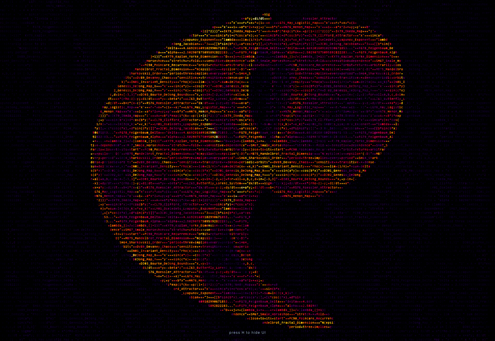

# De Jong Strange Attractors: An ASCII Simulation

Try It!: https://vslegion.github.io/DeJong-Strange-Attractors/

A real-time, zero-dependency browser toy that renders the **Peter de Jong strange attractor**
as a ghostly, oscilloscope-style web of tiny monospace glyphs. It calculates tens of thousands
of orbit iterations per frame to map out the attractor's invariant density — a live experiment
in discrete dynamical systems, chaos theory, and generative typography.

The whole thing lives in a single file: **`index.html`**.

## Features

* **Two-layer renderer:**
  * **Code sky** — a dim, slow, drifting fBm field of streaming glyphs behind everything, for
    a "lensed code" atmosphere. It knows nothing about the attractor.
  * **Phosphor web** — an invariant density histogram accumulated over millions of iterations.
    The grid fades a little each frame while the orbit paints fresh visits, so the newest
    iterations glow brightest and old cells decay slowly — the oscilloscope look. Log
    tone-mapped to reveal faint outer bands.
* **Live chaos telemetry:** a dedicated probe orbit estimates the **Lyapunov exponent (λ)** each
  frame, so you can see whether the current shape is chaotic, periodic, or marginal.
* **Real-time controls:** tweak the `a, b, c, d` parameters, exposure, drift speed, iteration
  count, and more from the slider panel. Click any value to type an exact number.
* **Curated palettes:** a liquid, in-water default (**Aqua**) plus **Abyss** and **Lagoon**
  water ramps, and five classics — **Inferno, Ice, Viridis, Matrix, Solar**.
* **Adaptive performance:** iteration count scales down automatically if the frame rate sags,
  then recovers, keeping the motion smooth.
* **Zero dependencies:** 100% vanilla HTML, CSS, and JavaScript in one file.

## The Math

The engine is a discrete-time 2D map proposed by Peter de Jong — an iterative feedback loop
governed by two trigonometric formulas:

$$x_{n+1} = \sin(a \cdot y_n) - \cos(b \cdot x_n)$$
$$y_{n+1} = \sin(c \cdot x_n) - \cos(d \cdot y_n)$$

Iterating the outputs back into the inputs, every point stays strictly bounded within a
$[-2.05, 2.05]^2$ box and settles onto an infinitely complex fractal manifold.

## Getting Started

### How to Run
1. Clone or download this repository.
2. Open `index.html` directly in any modern web browser (Chrome, Firefox, Safari, Edge).

### Controls & Usage
* **Controls (left panel):** adjust the parameters (`a, b, c, d`), motion, iteration count, and
  color palette. Hit **Randomize** for a new chaotic manifold, or **Reset** to return to default.
* **Telemetry (right panel):** live FPS, occupancy, and the Lyapunov λ score.
* **Keyboard:** press **H** to hide the UI for a clean, immersive view; **Esc** closes an open panel.

## Hacking the Code

The entire application is contained in `index.html` and is designed to be easy to modify.

* **Change the text:** find the `const SOURCE` string and swap in your own code snippet, poem, or
  text. The glyph web is rasterised from those characters.
* **Add a slider:** drop a new object into the `CONTROLS` array to expose any `CONFIG` value as a
  live control knob.
* **Add a palette:** add an entry to the `PALETTES` map — an eight-stop `[r,g,b]` ramp, dark to bright.

## Acknowledgments & References

* **Paul Bourke:** the mathematical constants, boundaries, and foundational knowledge of this
  attractor draw heavily on Paul Bourke's generative art archives. Full write-up:
  [Fractals: Peter de Jong Attractors](https://paulbourke.net/fractals/peterdejong/).
* **Presets:** several of the pre-configured parameter sets are sourced from Bourke's explorations.
